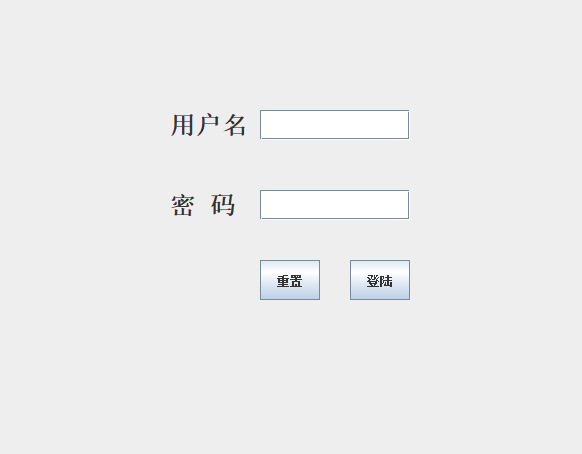
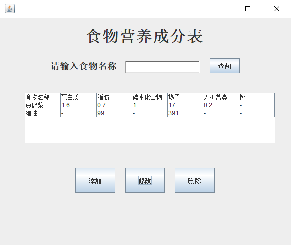

大一给别人写的数据库大作业，带可视化界面，Swing库编写，写的挺烂的，应付学校没问题，记得把自己的jdbc下好就行

由于源sql文件丢失，所以无法给出测试文件，自己写个sql建库即可

- 主方法在MAin类中，启动即为登陆页面，登陆用户以及密码都为root
- Land.java为登陆页面，可自行调节
- mainGui中为数据库操作页面，增删改查等`tableTitle`数组为表的字段，`tableContent`为数据，***注意***：数据必须要有
- 每个增删改查都有函数都有注释
- Connect类为连接数据库的原生jdbc代码，自行替换就好
- TableDef类为增删改查的功能函数，基本都是原生sql拼接，自行更改对应字段名即可
登陆：

主界面，主界面展示的数据并非数据库查询的数据，而是tablecontent中的数据

添加：

- 修改数据时先要查询，查出后的表格，是可以双击字段修改的，具体实现查看mainGui源码
